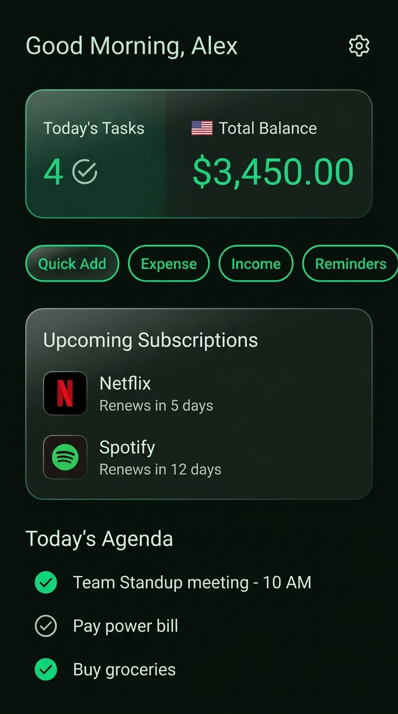
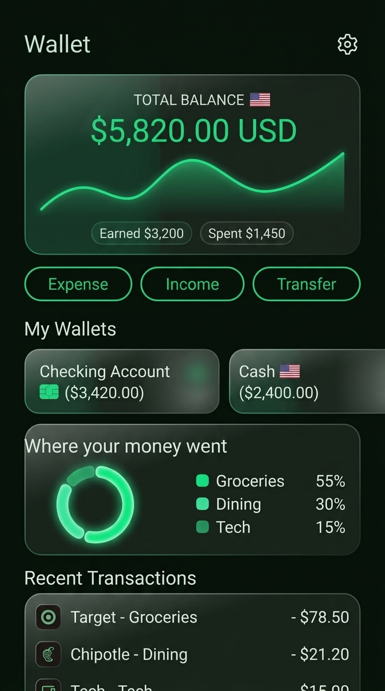
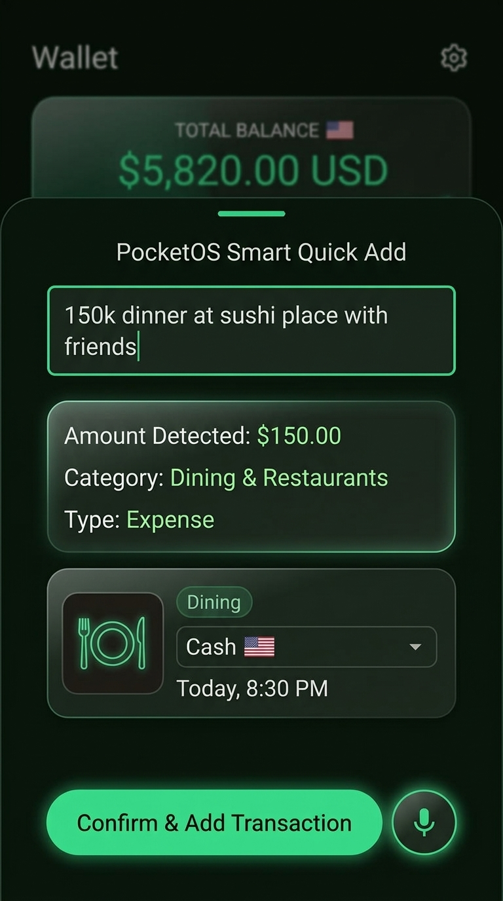
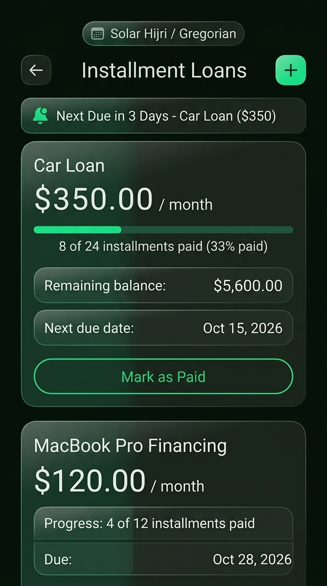
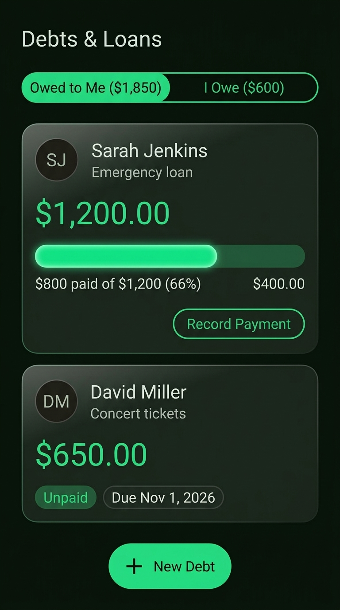
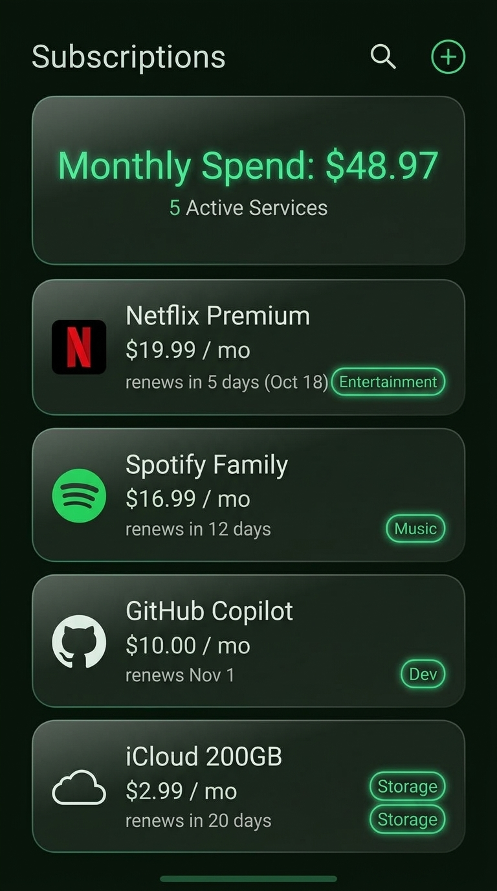

# PocketOS

<div align="center">

**Your private, offline personal command center for daily finances, installments, reminders, and subscriptions.**

*100% Local-First. Zero Cloud Tracking. Hardware-Backed Encryption.*

[](https://developer.android.com)
[](LICENSE)
[](#privacy--security)
[](https://github.com/pooriyayt/PocketOS/releases)

---

<p align="center">
  
  &nbsp;
  
  &nbsp;
  
</p>
<p align="center">
  
  &nbsp;
  
  &nbsp;
  
</p>

[English](#english) • [فارسی](#فارسی)

</div>

---

<a name="english"></a>
## English

PocketOS is a modern, privacy-first, local-first Android application designed to manage your personal finances, installment loans, debts & receivables, subscriptions, and daily tasks in one calm, unified dashboard.

There are **no accounts**, **no cloud sync servers**, and **no third-party tracking**. All data is stored directly on your phone in an **AES-256 encrypted database** managed by the **Android Keystore**.

### 🌟 Key Highlights

#### 🧠 Smart Quick Add (Natural Language Accounting)
- **Conversational Entry**: Type or speak everyday phrases like `"150k dinner at sushi place"`, `"taxi 35"`, `"salary 5000"`, or `"loan installment 250"`.
- **Instant Keyword & Amount Detection**: Automatically recognizes Western, Persian, and Arabic numbers, detects colloquial Iranian Toman scaling (`۱۵۰ تومن` → `150,000 تومان`), categorizes expenses, and infers payment methods.
- **Preview & Edit**: One-tap confirmation sheet lets you adjust categories, accounts, or dates before saving.

#### 🌍 Global Currency Support
- **160+ Currencies**: Full ISO 4217 world currency support with country flags and instant search.
- **Iranian Toman & Rial**: Native support for Toman (`IRT / تومان`) and Rial (`IRR / ریال`) with proper digit formatting and locale-aware groupings.
- **Multi-Wallet Balance**: Track cash, bank accounts, and cards in your preferred base currency.

#### 📆 Installments & Loan Management
- **Automated Installment Schedules**: Set up multi-month loans once with total installments, monthly due dates, and remaining counts.
- **Multi-Calendar Engine**: Full native support for **Solar Hijri / Jalali (شمسی)**, **Islamic / Lunar Hijri (قمری)**, and **Gregorian (میلادی)** calendars with a custom date picker.
- **Proactive Reminders**: Local scheduled notifications alert you 3 days before any installment is due and on the exact due date.
- **Auto-Rollforward**: Automatically advances to the next month upon payment confirmation.

#### 🤝 Debts & Receivables Tracker
- **"I Owe" & "Owed to Me"**: Track personal loans and borrowings with individuals or organizations.
- **Partial Repayments**: Record progressive partial payments, maintain repayment logs, and update balances dynamically.
- **Wallet Linking**: Optionally deduct or credit payments directly from your selected wallet account.

#### 💳 Subscription & Renewal Alerts
- **Offline Catalog**: Built-in recognition for hundreds of popular digital services (Netflix, Spotify, GitHub, YouTube, Telegram, etc.).
- **Smart Icons**: Choose bundled logos, vector icons, custom monograms, or website favicons.
- **Pre-Billing Notifications**: Timely alerts before billing cycles renew or free trials expire.

#### 🛡️ Ironclad Privacy & Security
- **100% Offline**: Works without network connectivity.
- **SQLCipher AES-256**: The local Room SQLite database is encrypted using SQLCipher. Master keys are securely generated and stored in the hardware-backed **Android Keystore**.
- **Encrypted Backups**: Export and import complete backups protected by **AES-256-GCM** with **PBKDF2** key derivation (100,000 iterations).

#### 🌿 Luxury Emerald UI
- **Refined Aesthetics**: Deep dark (`#090E0B`) and crisp light (`#F5F9F7`) palettes with fluid animations.
- **Liquid Morphing Navigation**: Dynamic indicator drops, bouncy icons, and haptic feedback.
- **Glance AppWidgets**: Home screen widgets for immediate glanceable overview of pending tasks and balances.

---

<a name="فارسی"></a>
## فارسی

پاکت او اس (**PocketOS**) یک اپلیکیشن مدرن، کاملاً آفلاین و با تمرکز بر حفظ حداکثری حریم خصوصی برای اندروید است که به شما امکان می‌دهد تراکنش‌های مالی، اقساط وام‌ها، طلب و بدهی‌ها، یادآورها و اشتراک‌های خود را در یک محیط زیبا، یکپارچه و امن مدیریت کنید.

در پاکت او اس **هیچ نیازی به ساخت حساب کاربری، اتصال به سرورهای ابری، یا ردیابی فعالیت‌ها نیست**. تمامی اطلاعات شما به صورت محلی و با رمزنگاری پیشرفته **AES-256** تحت محافظت سخت‌افزاری **Android Keystore** فقط و فقط روی حافظه دستگاه خودتان نگهداری می‌شود.

### 🌟 ویژگی‌های برجسته

#### 🧠 ثبت سریع و هوشمند (Smart Quick Add)
- **تشخیص زبان عامیانه و متن آزاد**: متن‌هایی نظیر «۱۵۰ تومن ساندویچ»، «اسنپ ۳۵ تومن»، «حقوق ۵ میلیون» یا «قسط وام» را بنویسید تا برنامه به طور خودکار نوع تراکنش، مبلغ، و دسته‌بندی مناسب را شناسایی کند.
- **تبدیل هوشمند تومان و هزار تومان**: اعداد عامیانه فارسی نظیر «۱۵۰ تومن» به طور هوشمند به ۱۵۰٬۰۰۰ تومان مقیاس‌بندی می‌شوند.
- **پیش‌نمایش قبل از ذخیره**: امکان تغییر دسته‌بندی، کیف پول یا تاریخ با یک لمس قبل از ثبت نهایی.

#### 🌍 پشتیبانی از تمامی ارزهای جهان
- **بیش از ۱۶۰ ارز بین‌المللی**: همراه با پرچم کشورها و جستجوی لحظه‌ای بر اساس کد و نام ارز.
- **پشتیبانی کامل از تومان و ریال**: امکان انتخاب «تومان (IRT)» یا «ریال (IRR)» با فرمت‌بندی استاندارد ارقام فارسی و جداسازی سه رقمی.
- **مدیریت چند کیف پول**: حساب‌های بانکی، کارت‌ها و موجودی نقدی را مجزا ثبت کنید.

#### 📆 مدیریت پیشرفته اقساط و وام‌ها
- **ثبت اقساط ماهیانه**: یک‌بار وام را با تعداد کل اقساط و مبلغ هر قسط ثبت کنید تا بدون نیاز به ثبت مجدد ماهانه، اقساط باقی‌مانده و سررسید به طور خودکار محاسبه شود.
- **موتور تقویم سه‌گانه**: پشتیبانی کامل از **تقویم هجری شمسی (جلالی)**، **تقویم هجری قمری** و **تقویم میلادی (Gregorian)** با دیت‌پیکر اختصاصی.
- **یادآوری هوشمند سررسید**: ارسال نوتیفیکیشن محلی ۳ روز پیش از موعد قسط و همچنین در روز سررسید.
- **انتقال خودکار به قسط بعد**: با ثبت هر پرداخت، وضعیت وام به‌روز شده و سررسید قسط بعدی محاسبه می‌گردد.

#### 🤝 مدیریت بدهی‌ها و طلب‌ها
- **بخش اختصاصی «بدهکارم / بستانکارم»**: پیگیری مبالغی که از دیگران طلب دارید یا به آن‌ها مقروض هستید.
- **ثبت تسویه و بازپرداخت‌های جزئی**: ثبت چند مرحله‌ای بازپرداخت، مشاهده مانده نهایی و لاگ تاریخچه پرداخت‌ها.
- **اتصال اختیاری به کیف پول**: امکان کسر یا واریز خودکار مبلغ پرداخت به کیف پول انتخابی.

#### 💳 پیگیری اشتراک‌ها و هزینه‌های دوره‌ای
- **کاتالوگ سرویس‌های محبوب**: شناسایی خودکار سرویس‌ها (اسپاتیفای، یوتیوب، گیت‌هاب، نتفلیکس، تلگرام و...).
- **هشدار قبل از اتمام تمدید**: نوتیفیکیشن‌های پیش از تمدید مجدد یا پایان دوره آزمایشی رایگان (Free Trial).

#### 🛡️ امنیت و حریم خصوصی مطلق
- **کاملاً آفلاین**: برنامه بدون نیاز به اینترنت عمل می‌کند.
- **رمزنگاری سرتاسری پایگاه داده**: استفاده از پایگاه داده امن SQLCipher با کلید مشتق‌شده از ماژول امنیتی دستگاه (Android Keystore).
- **پشتیبان‌گیری رمزنگاری‌شده**: قابلیت تهیه فایل بکاپ با رمز عبور دلخواه به صورت فایل رمزگذاری‌شده با الگوریتم **AES-256-GCM** و **PBKDF2** (۱۰۰ هزار دور).

---

## Security & Google Play Protect

PocketOS conforms to standard Android application security and privacy guidelines:
- **No Dropper Permissions in Store Flavor**: The `myket` release build removes `REQUEST_INSTALL_PACKAGES` completely to adhere strictly to Google Play Protect policies for sideloaded and independent store installations.
- **Hardware-Protected Keys**: No plain-text passwords or secret keys exist in the application files.
- **Minimal Permissions**: Only requests strictly needed system capabilities (`POST_NOTIFICATIONS`, `SCHEDULE_EXACT_ALARM`, `USE_BIOMETRIC`).
- **Reproducible Signed Binaries**: Built with ProGuard/R8 dead-code stripping, resource shrinking, and full optimization.

---

## Building from Source

### Prerequisites
- **JDK 17** or **JDK 21**
- **Android SDK** (API 26 minSdk, API 36 targetSdk, API 37 compileSdk)
- **Gradle 9.x** (wrapper included)

### Build Commands

```bash
# Clone the repository
git clone https://github.com/pooriyayt/PocketOS.git
cd PocketOS

# Build debug APK
./gradlew assembleDebug

# Build release APKs (Standard Clean Flavor)
./gradlew assembleMyketRelease

# Build release APKs (GitHub Self-Updating Flavor)
./gradlew assembleGithubRelease
```

The compiled APKs will be located in:
- `app/build/outputs/apk/myket/release/app-myket-release.apk`
- `app/build/outputs/apk/github/release/app-github-release.apk`

---

## Architecture & Tech Stack

- **UI Framework**: Modern Jetpack Compose, Material 3, Navigation Compose, Compose Animation.
- **Architecture**: MVI / MVVM with Kotlin Coroutines & StateFlow.
- **Database & Persistence**: Room + SQLCipher (Hardware Keystore protected).
- **Time & Calendar**: Java Time (`java.time.*`), Chrono classes for Hijri and Jalali calendar conversion.
- **Widgets**: Jetpack Glance Compose for Android Home Screen widgets.
- **Dependency Injection**: Manual scoped container architecture (`AppContainer`) ensuring fast cold starts and zero reflection overhead.

---

## License

```
Copyright 2026 PocketOS Contributors

Licensed under the Apache License, Version 2.0 (the "License");
you may not use this file except in compliance with the License.
You may obtain a copy of the License at

    http://www.apache.org/licenses/LICENSE-2.0

Unless required by applicable law or agreed to in writing, software
distributed under the License is distributed on an "AS IS" BASIS,
WITHOUT WARRANTIES OR CONDITIONS OF ANY KIND, either express or implied.
See the License for the specific language governing permissions and
limitations under the License.
```
